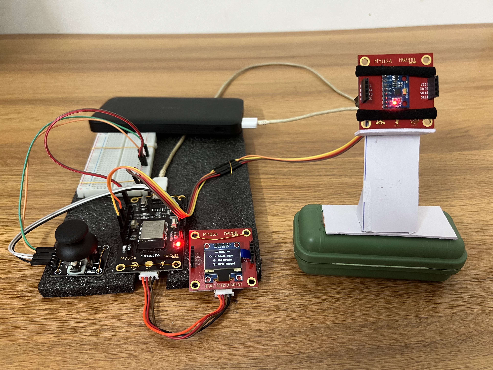
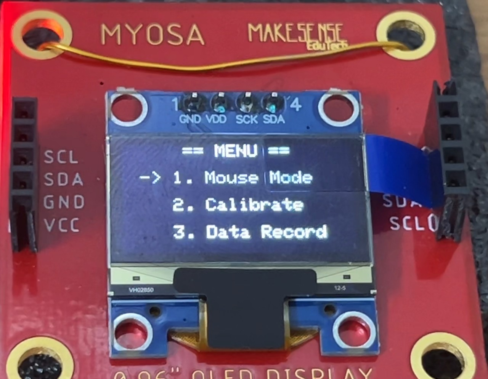

> SteadyPoint adapts the device to the user, not the user to the device.

---

## Acknowledgements

This project is developed by **Team ElectroNauts**, a team of Electrical and
Electronics Engineering students from Christ College of Engineering
(Autonomous), Irinjalakuda, for the IEEE MYOSA Innovation Challenge. We thank
our faculty mentors, the MYOSA organizing team, and MakeSense EduTech for
providing a platform that makes affordable, embedded assistive technology
possible.

---

## Overview

Millions of people living with Parkinson's disease, Essential Tremor, ALS, and
post-stroke motor impairments struggle with everyday computer input devices,
because conventional mice and motion controllers assume stable, precise hand
movement. Fixed-sensitivity pointing devices simply don't work for hands that
shake.

SteadyPoint is a personalized adaptive motion interface built around the MYOSA
board. Instead of forcing the user to adapt to rigid sensitivity settings,
SteadyPoint **continuously learns how this specific user moves** and adapts
itself in real time — filtering out involuntary tremor while preserving
intentional motion, so cursor control becomes smooth, predictable, and
genuinely usable. All controls are provided through a gross-motor-friendly
analog joystick, so users with tremors never need fine-motor button precision.

**Key features:**

* Personalized 10-second calibration that learns the user's tremor amplitude and frequency
* **SPARK** (SteadyPoint Adaptive Response Kernel) — real-time adaptive filtering that separates intent from tremor
* Joystick-based accessible input: clicks, scrolling, speed profiles, and menus without fine-motor buttons
* Wireless Bluetooth HID communication — works like a standard mouse on any computer, no drivers required
* OLED feedback showing calibration, the learned SPARK profile, and live operating mode
* Labeled 100 Hz IMU data-collection pipeline for research and re-training

| Conventional motion mouse | SteadyPoint |
|---|---|
| Fixed sensitivity for all users | Personalized per-user motion profile |
| Tremor passes straight to cursor | Tremor band filtered adaptively |
| Manual sensitivity buttons | Automatic real-time adaptation |
| Fine-motor click buttons | Joystick-based accessible input |
| No feedback | Live OLED + SPARK telemetry |

---

## Demo / Examples

### **Images**

<p align="center">
<br/>
<i>SteadyPoint system overview — MYOSA board as the sensing and processing hub</i>
</p>

<p align="center">
<br/>
<i>OLED flow: Splash → Menu → Mouse mode/Calibration/Data Collection</i>
</p>


### **Videos**

<video controls width="100%">
<source src="steadypoint-demo.mp4" type="video/mp4">
</video>

---

## Features (Detailed)

### **1. Motion Acquisition**

The MPU6050 captures wrist rotation and motion data continuously. Raw
gyroscope readings (degrees/second) feed both the cursor-control pipeline and
the tremor-analysis pipeline, giving SteadyPoint a reliable picture of how the
user's hand is actually moving. The sensor's vertical axis is inverted in
firmware so that wrist-up naturally maps to cursor-up.

### **2. SteadyPoint Adaptive Response Kernel (SPARK)**

SPARK is the core innovation. It models the user's hand as a combination of
*intentional* low-frequency rotation (< 2–3 Hz) and *involuntary* tremor
(typically 4–12 Hz), then separates them with a stability-preserving adaptive
2nd-order Butterworth biquad low-pass filter.

**Personalization (calibration phase):**

```
bias            = mean(gx, gy, gz) over the 10 s still-hold
tremorAmplitude = RMS deviation of gyro magnitude
tremorFrequency = (hysteresis zero-crossings / 2) / duration
initialCutoff   = clamp(0.4 × tremorFrequency, 1.5 Hz, 8 Hz)
```

**Live adaptation (runtime):** a 20-sample window computes sustained intent vs.
jitter; the filter cutoff adapts between 1.5 Hz (maximum tremor suppression)
and 12 Hz (minimum lag for fast intentional moves):

```
drive  = sustained / (jitter + tremorAmplitude)
cutoff = 0.9·cutoff + 0.1·(1.5 + 10.5·min(drive, 1))
```

| Hand state | Signal signature | SPARK action |
|---|---|---|
| Still | magnitude < noise floor | Cursor frozen |
| Tremor | high jitter, ~zero net motion | Heavy filtering (low cutoff) |
| Intent | sustained directional motion | Cutoff opens, cursor tracks |

### **3. Personalized User Calibration**

A guided 10-second countdown records the user's natural resting movement. The
learned profile — tremor **amplitude**, **frequency**, and the resulting **AI
cutoff** — is shown on a dedicated **SPARK Profile screen**, making the
adaptation transparent and verifiable before use.

### **4. Joystick-Based Accessible Input**

Every control is large and gross-motor-friendly, so users whose tremors
prevent reliable button presses can still operate a full mouse:

| Control | Action |
|---|---|
| Wrist rotation (IMU) | Cursor movement (SPARK-filtered) |
| Joystick UP | Pointer home (reset to top right corner) |
| Joystick DOWN | Cycle speed profile (1 → 2 → 3) |
| Joystick LEFT / RIGHT | Left / right click |
| Switch short press | Toggle Mouse ↔ Scroll mode |
| Switch long press (2 s) | Return to main menu |

### **5. Wireless BLE HID**

Built on the HijelHID_BLEMouse library (NimBLE-Arduino), SteadyPoint presents
itself as a standard Bluetooth HID mouse: cross-platform support (Windows,
Android, macOS, Linux; iOS with AssistiveTouch), automatic power saving when
idle, and bond management — no special drivers required.

### **6. OLED User Interface**

| Screen | Content |
|---|---|
| Splash | SteadyPoint — Team ElectroNauts |
| Menu | Mouse / Calibrate / Data Record |
| Countdown | 10 s calibration with skip |
| SPARK Profile | Learned amplitude, tremor Hz, AI cutoff Hz |
| Mouse mode | GX/GY, mode (MOVE/SCROLL), speed, SPARK status |

### **7. Labeled Data-Collection Pipeline**

For research and re-training, a boot option streams 100 Hz labeled IMU data
over USB serial through an 11-phase protocol (still table, still hand, slow
intent, fast intent, vibration), producing a CSV dataset
(`steady_point_dataset.csv`) for offline analysis.

---

## Usage Instructions

1. **Assemble** — MPU6050 and SSD1306 OLED on the MYOSA I2C bus (SDA 21 / SCL
   22); analog joystick on GPIO 34 (X), 35 (Y), 32 (switch).
2. **Install libraries** — see Requirements below.
3. **Upload** — open `SteadyPointV5-SPARK.ino`, select *ESP32 Dev Module*,
   upload.
4. **Pair** — power on and select *SteadyPoint* in the host's Bluetooth
   settings (on Windows, remove old pairings first if the device was
   reflashed).
5. **Calibrate** — choose *Calibrate*, hold the device naturally still for the
   10 s countdown, review the SPARK Profile, press the switch to continue.
6. **Use** — choose *Mouse Mode*; move the wrist to steer the cursor and use
   the joystick for clicks, scroll mode, and speed profiles.

```cpp
// Simplified SPARK adaptive filtering concept (from ai_module.h)
ai.update(gx, gy, gz);              // adapt cutoff from intent vs. jitter
float filtered = ai.filterX(gx);    // bias removed + biquad low-pass
filtered = imu.applyDeadZone(filtered, GYRO_DEAD_ZONE);
int dy = (int)(filtered * speed);   // cursor delta
ble.move(dx, dy);                   // standard HID report
```

---

## Tech Stack

* **Microcontroller** — ESP32 (MYOSA platform)
* **IMU** — MPU6050 (gyroscope-driven cursor + tremor analysis)
* **Display** — SSD1306 OLED 128×64 (I2C)
* **Input** — Analog joystick + switch (accessible alternative to fine-motor buttons)
* **Firmware** — Modular Arduino C++ (SPARK kernel, state machine, hardware modules)
* **BLE stack** — NimBLE-Arduino via HijelHID_BLEMouse
* **Tooling** — Python (dataset visualization and SPARK training analysis)

---

## Requirements / Installation

**Basic libraries (Arduino Library Manager):**

```
Adafruit GFX Library      latest     — core OLED graphics primitives
Adafruit SSD1306          latest     — SSD1306 OLED driver (I2C, 0x3C)
NimBLE-Arduino            >= 2.3.8   — BLE stack (required by HijelHID_BLEMouse)
```

**MYOSA / custom libraries (bundled in the repo under `libraries/`):**

```
AccelAndGyro              — MYOSA custom MPU6050 driver (I2C, 0x69)
HijelHID_BLEMouse         — custom BLE HID mouse library (device name "SteadyPoint")
```

**Board support:**

```
ESP32 Arduino Core        3.x
Board:  ESP32 Dev Module
CPU Frequency: 240 MHz | Upload Speed: 921600
```

CLI install for the basic libraries (optional):

```bash
arduino-cli lib install "Adafruit GFX Library" "Adafruit SSD1306" "NimBLE-Arduino"
```

The two custom libraries ship inside the project folder (`libraries/AccelAndGyro`,
`libraries/HijelHID_BLEMouse`) — no extra installation needed, just keep them
next to the sketch.

---

## File Structure

```
/SteadyPoint_ElectroNauts
├─ myosa-steadypoint.md              ← this submission
├─ steadypoint-demo.mp4
├─ steadypoint-cover.jpg
├─ steadypoint-screens.jpg
├─ steadypoint-workflow.jpg
├─ steady_point_dataset.csv          ← labeled 100 Hz IMU dataset
└─ firmware/
   ├─ SteadyPointV5-SPARK.ino
   ├─ config.h
   ├─ ai_module.h                    (SPARK kernel)
   ├─ imu_module.h
   ├─ display_module.h
   ├─ ble_mouse_module.h
   ├─ joystick_module.h
   └─ state_machine.h
```

---

## License

This project is licensed under the MIT License.

---

## Contribution Notes

Future work: an optional touchless gesture add-on (APDS9960) for users who
prefer gesture navigation, on-device incremental re-training of the SPARK
profile, and a TinyML tremor classifier for multi-condition profiles. The
architecture is intentionally modular and can extend to rehabilitation
devices, wearable controllers, and smart-home interaction. Contributions and
issue reports are welcome via the MYOSA GitHub repository.